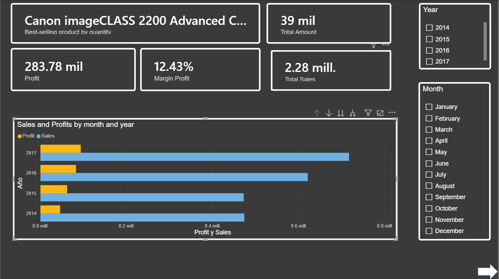
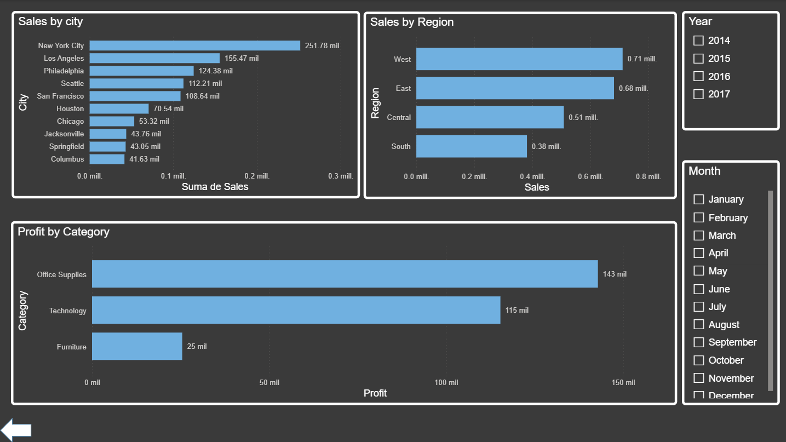

## Commercial Performance and Profitability Analysis (Superstore)

### Project Overview
This project focuses on analyzing transactional data from a multi-regional retail operation to evaluate revenue streams, category performance, and regional profitability. The objective is to isolate low-performing variables and highlight structural factors impacting the net margin.

### Data Extraction and Normalization
A critical phase of the data preparation involved solving a regional configuration conflict. The source file utilized a standard US date structure (MM/DD/YYYY), which conflicted with regional server environments set to European or Latin American standards (DD/MM/YYYY). 

To prevent data loss, structural errors, or blank values upon data model loading, the type conversion was explicitly managed via Power Query using localized locale parameters:
* Data type coercion enforced via English (United States) locale context.
* Preserved 100% of order logs, neutralizing data fragmentation in specific periods such as October 2015.

### Key Insights

#### 1. Category and Product Line Performance
The dataset shows an asymmetric relationship between revenue volume and actual profitability across the major business segments:
* **Office Supplies:** This category represents the most stable and efficient driver, generating $876,206.54 in sales and yielding the highest absolute net profit of $142,923.22.
* **Technology:** Driven primarily by high-value sub-categories like Phones and Copiers, it achieved $740,885.51 in sales and $115,376.14 in profit. Copiers demonstrated the highest internal conversion margin, securing $41,772.76 in returns over a compressed sales volume of $115,994.11.
* **Furniture:** While generating significant top-line revenue ($665,702.17), its net margin is heavily compressed, returning only $25,483.13 in profit.

#### 2. Sub-Category Deficits
Granular analysis reveals that specific product lines are actively diluting corporate margins due to high costs or aggressive discount structures:
* **Tables:** Represents the largest deficit line, accumulating a net loss of -$10,944.55 on $185,452.68 of sales.
* **Machines and Bookcases:** Combined, these lines generated an additional net deficit exceeding -$5,300.00, indicating that high revenue in these segments does not correlate with financial health.

#### 3. Regional Demographics
* **West and East Regions:** These territories act as the primary operational anchors. The West region leads overall performance with $711,287.06 in sales and $106,065.36 in profit, followed closely by the East region with $681,583.72 in sales and $84,081.61 in profit.
* **Central Region:** Shows a severe efficiency constraint, returning only $47,785.88 in profit despite generating over half a million dollars ($508,498.41) in sales volume.

### Tech Stack
* Power BI Desktop
* Power Query 
* DAX 

## Dashboard Architecture
Below are the primary views of the developed Power BI dashboard, illustrating the distribution of KPIs and operational margins across different business dimensions.

*Figure 1: Main executive view showcasing high-level KPIs, global sales distribution, and total profitability.*

*Figure 2: Granular view focusing on regional efficiency metrics and sub-category performance distributions.*